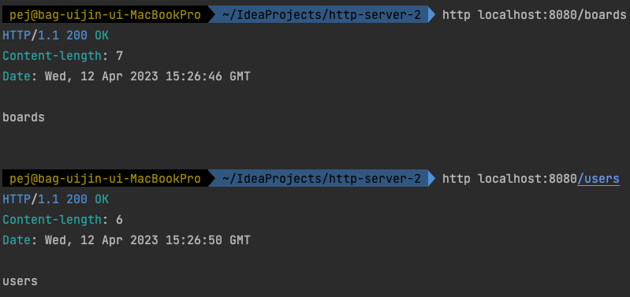
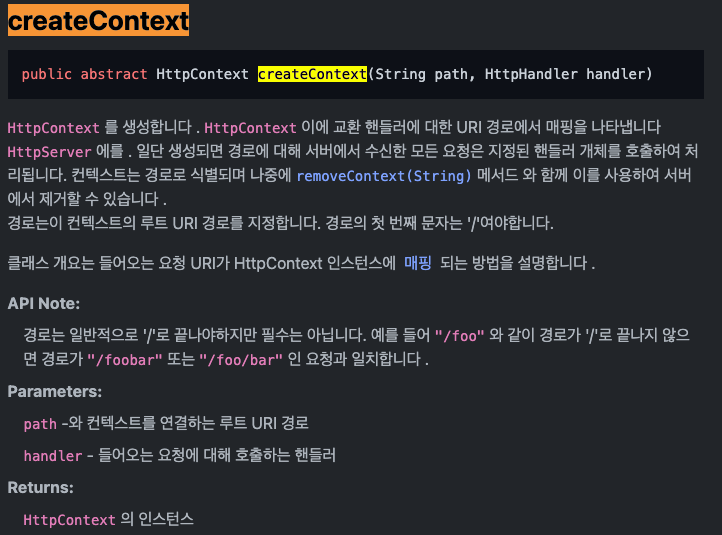

# Java HTTP Server


### HttpServer Library
- 이 전에는 소켓 클래스와 서버소켓 클래스를 이용하여 HTTP 서버를 구성한 반면 좀 더 구현하기 쉽게 자바에서는 HttpServer라는 라이브러리를 제공한다. 
- 이 라이브러리를 사용하여 HTTP 서버를 간단하게 구축해보자.
- 해당 라이브러리는 내부적으로 NIO 즉, 논-블로킹을 사용한다는데 이 형태가 자바 애플리케이션으로써 코드를 구현 후 어떻게 재현하여 동작하는지는 아직 감이 안온다.

#### 서버 객체 준비 (Listen)
> - InetSocketAddress은 IP 소켓 주소뿐 아니라 hostname과 portname으로도 구성이 가능하다고 한다.
> - HttpServer 클래스를 사용하여 서버의 주소와 포트를 정한다.
```java
InetSocketAddress address = new InetSocketAddress(8080);
HttpServer httpServer = HttpServer.create(address, 0);
```

#### Path 핸들러 지정
- 클라이언트는 각기 다른 액션을 취해서 요청을 보낼텐데 이것을 서버에서는 url을 구분하여 요청들을 핸들링한다.
- 예를 들어서 localhost/boards와 localhost/users 처럼 서버에서는 url의 리소스를 구분하여 핸들링한다고 보면 될 것 같다.
- 실습 코드는 아래와 같다.

> - 이렇게 createContext로 각각의 라우터를 생성하면 지정한 경로에 따라서 요청 URL 경로에 따른 각기 다른 동작을 구현할 수 있다.
> - 자바에서 람다식을 해보는건 처음인데 꽤나 신기하다. 이 부분은 좀 더 알아봐야겠다.
```java
httpServer.createContext("/boards", (exchange) -> {
  String content = "boards\n";
  byte[] bytes = content.getBytes();

  // 여기서 예외처리를 하게 된다면 404 같은 에러로 respeonse를 할 수 있나보다.
  exchange.sendResponseHeaders(200, bytes.length);

  OutputStream responseBody = exchange.getResponseBody();
  responseBody.write(bytes);
  responseBody.flush();
});

httpServer.createContext("/users", (exchange) -> {
  String content = "users\n";
  byte[] bytes = content.getBytes();

  exchange.sendResponseHeaders(200, bytes.length);

  OutputStream responseBody = exchange.getResponseBody();
  responseBody.write(bytes);
  responseBody.flush();
});
```

> - 실행화면



> - createContext에 대한 설명

[createContext](https://runebook.dev/ko/docs/openjdk/jdk.httpserver/com/sun/net/httpserver/httpserver).




#### Listen
- 서버는 수신 대기할 객체를 생성하고 각각의 경로로 들어오는 라우터들을 생성한다음에 대기준비를 한다.
```java
httpServer.start();
```

#### Request
- 서버는 각각의 경로로 들어온 요청들을 먼저 **읽고** 처리해준다.
- handler를 사용하여 요청(Request) 파라미터를 가져올 수 있다.
- handler는 HTTP를 교환을 처리한다고 하는데 **교환**이라는 의미가 좀 생소하다. 
- createContext의 매개변수 2번째에는 HttpHandler 객체를 받을 수 있는데 이를 또 위와 같이 람다로 표현했다. 저 람다식의 exchange가 HttpHandler이다.

> createContext 2번째 매개변수로 들어가는 HttpHandler 객체
```java
httpServer.createContext("/", (exchange) -> { });
```

> handler를 이용한 코드
```java
httpServer.createContext("/", (exchange) -> { 
  String requestMethod = exchange.getRequestMethod();
  System.out.println("Method : " + requestMethod);

  URI requestURI = exchange.getRequestURI();
  String path = requestURI.getPath();
  System.out.println("Path : " + path);

  Headers requestHeaders = exchange.getRequestHeaders();
  for (String key : requestHeaders.keySet()) {
    List<String> values = requestHeaders.get(key);
    System.out.println(key + ": " + values);
  }

  InputStream requestBody = exchange.getRequestBody();
  String body = new String(requestBody.readAllBytes());

  System.out.println("body : " + body);
});
```

- getRequestMethod()로 요청받은 HTTP 메소드를 알 수 있다.
- getRequestURI()로 uri path를 알 수 있다.
- getRequestHeaders()로 요청받은 헤더 정보들을 알 수 있다. 
  - 헤더 정보들은 여러개라 Map 자료구조의 set을 이용하여 데이터를 꺼낸다.
- getRequestBody()로 요청받은 body의 데이터를 알 수 있다.
  - 스트림으로 받은것을 바이트로 읽어내야한다.


#### Response
- 요청에 대한 처리가 끝났으면 서버는 응답을 해주어야 한다.

- 각각의 라우터마다 요청 처리하고 response를 위한 content를 만든다. (메세지)
- 또 응답을 줄때는 HTTP 상태 코드와 Content-length(bytes 길이)를 지정해주어야 한다고 한다.
```java
String content = "hihi";
byte[] bytes = content.getBytes();

// 상태코드 지정
exchange.sendResponseHeaders(200, bytes.length);

// 데이터 전송 부분
OutputStream responseBody = exchange.getResponseBody();
responseBody.write(bytes);
responseBody.flush();
```


- 확실히 소켓 클래스를 사용한거보다 쉽게 처리가 가능한거같다.
- 소켓에서는 일일이 파싱해야하는 것들을 HttpServer 라이브러리의 메서드들을 이용하면 쉽게 가져올 수 있다.
  - 헤더라던지, 메소드라던지 ... 


### 학습 키워드
- Java HTTP Server
- Java NIO
- Java Lambda expression(람다식)
  - Java Functional interface(함수형 인터페이스)