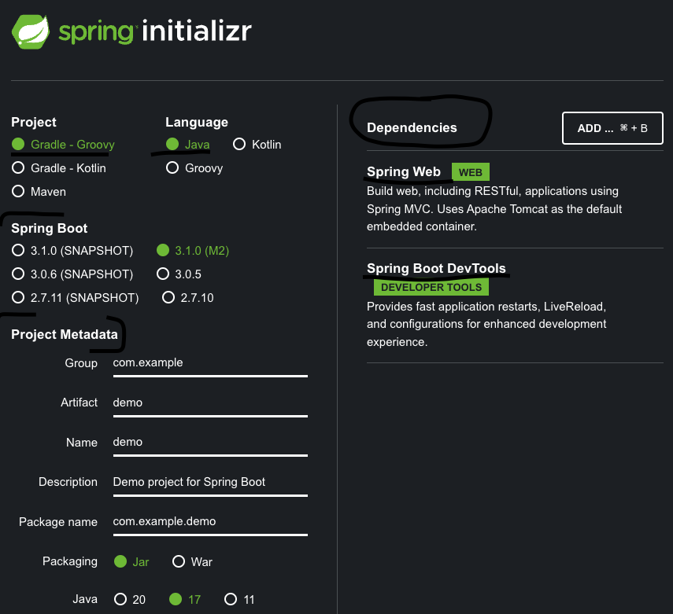
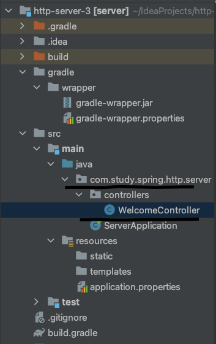

# Spring Web MVC


### 실습하기에 앞서
- 이번에는 Spring Web MVC를 이용하여 HTTP 서버를 구현해보았다. 
- 실습을 하기전에 **Spring Web MVC**가 무엇인가를 알아보았다.
- 기본은 Spring에서 제공하는 웹 모듈이라고 한다. 
- 소켓, HttpServer 라이브러리를 사용해서 HTTP 서버를 구현한것처럼 Spring Web MVC 모듈을 사용하면 더 간편하게 구축할 수 있다고 한다. 
- MVC 아키텍처 패턴이 녹여져있고 HTTP 요청처리부터 응답의 다양성을 제공한다. 
  - 어노테이션 중 ResponseBody를 통해 JSON 형태로 응답하는 구조를 본적이 있는것 같다.

> 내가 지금 하고 있는 NestJs와 매우 유사하다 이녀석은 앵귤러를 본따만들었다고 하는데 아무리봐도 Spring으로 느껴진다...


### MVC 패턴
- 먼저 MVC가 무엇인지 알아보았다. 
- MVC는 애플리케이션을 만들 떄 구성요소를 세 가지의 역할로 나눈 패턴이다.
- M, V, C 각각의 역할을 코드 레벨로써 구현하면 된다.
- 예를 들어 Controller에서는 요청받은 주소에 맞는 Controller에게 전달된다.
- 또한 Spring에는 요청이 Controller에 가기 전 DispatcherServlet(일명 FrontController)이라는 것을 먼저 통한다고 한다. 
  - 여기에서 알맞은 컨트롤러에게 전달하는 느낌인거 같다.

> 각각의 설명은 추상적인 수준의 내용으로만 알고있고 추후에 이해하도록하자
#### M : Model
- 데이터와 비즈니스 로직을 관리
- 핵심 비즈니스 로직
  - 아마 비즈니스 모델이나 DTO, DB를 연결하는 Connection pool, 쿼리 등등 일련의 데이터를 조작하는 로직을 담당하는 계층이 아닐까 싶다.

#### V : View
- 레이아웃과 화면을 처리
  - 화면이니 JSP 같은 UI적 레이아웃들을 말하는게 아닐까 ?
  - 모델에서 가져온 데이터들을 뿌려주는 ?

#### C : Controller
- 모델과 뷰 부분으로 라우팅
  - 유저가 어떤 동작을 요청하거나 혹은 어떤 홈페이지에 접속했을때 URL을 요청하면 해당 URL에 맞는 뷰를 제공하는 역할인 것 같다.

> Rails와 Active Record 아키텍처 패턴이란것도 있다.

### 스프링 Web MVC 세팅
- 개념적으로 알아도 이게 무슨말인지 모를때가 많다. 
- 역시 실습이 최고다. 
- 구현을 통해 MVC 구조가 코드레벨로써는 어떻게 구성되는지 대략적으로 알 수 있었다.

> 스프링 세팅을 도와주는 사이트이다.
[https://start.spring.io/](https://start.spring.io/).



1. Project : 빌드 툴을 정한다. (기본은 Groovy)
  - Groovy는 자바 얼굴에 점하나 찍고 다른 사람이라고 한다는 썰이 있다.
2. Language : 사용 언어 선택
  - 당연히 Java
3. Spring Boot : 스프링 부트의 버전을 선택한다.
  - 나는 M2버전을 선택했다. 사실.. M2가 칩셋을 뜻하는줄 알았다.. (미리 찾아볼걸)
4. Project Metadata : 프로젝트 정보를 구성한다
  - 이름, 패키지명, Jar냐 War냐, 자바 버전
5. Dependencies : 추가할 모듈
  - 스프링 프로젝트 생성 전 기본적으로 가져갈 모듈을 선택한다.
  - Spring Web 모듈은 당연히 가져온다. 이걸로 HTTP 서버를 만들기 때문
  - Sprging Boot DevTools : 이건 코드 변경이 일어나면 자동으로 애플리케이션을 재시작 해준다고 한다.

- GENERATE를 누르고 다운받은 zip 파일을 열어 인텔리제이로 프로젝트를 실행한다.

### Controller 구현
- 기본 패키지 루트 아래에다 컨트롤러 패키지를 추가한 후 WelcomeContoller 클래스 생성.



> 코드 작성
```java
@RestController
public class WelcomeController {
  @GetMapping("/")
  @ResponseStatus(HttpStatus.OK)
  public String home() {
    return "hello\n";
  }

  @GetMapping("/hi")
  public String hi() {
    return "hi\n";
  }

  @PostMapping("/")
  @ResponseStatus(HttpStatus.CREATED)
  public void create(@RequestBody String body) {
    System.out.println("body : " + body);
  }
}
```

> 이렇게 구성하고 애플리케이션을 실행 후 curl이나 httpie를 사용하여 요청을 보내면 그대로 응답이 온다. 


1. 확실히 프레임워크를 사용하니 소켓, HttpServer 클래스를 사용한 것보다 구현이 너무 쉽다.
  - 프레임워크에서 짜놓은 구조에 맞추기만 하면 되니까 ..?
2. 하지만 방대한 어노테이션들을 알아야하고 쓰임새도 알아야한다. 
  - 예전에는 프레임워크 말고 일일이 직접 구현했다면, 현재는 만들어진 것을 얼마나 잘 찾고 얼마나 잘 쓰느냐가 관건인것 같다.
3. 어노테이션을 뒤적여 봤는데 어노테이션 안에 또다른 어노테이션들이 달려있다.
4. 예전에 RestController 라는 어노테이션을 사용하면 해당 컨트롤러의 response가 모두 Json의 형태를 응답한다고 들은거 같다.
  - 그 이유가 RestController 어노테이션 안에 ResponseBody 어노테이션이 내장되어 있기 때문이었다.
  - 이래서 어노테이션을 확인하라는 것의 의미를 이제야 깨달았다.
5. 프레임워크를 사용해서 애플리케이션을 만드는 것도 좋지만 동작하는 원리를 모르면 나중에 한계를 겪게된다. (물론 에러 찾기 힘들다는 것도 덤으로)
  - 적어도 프레임워크가 어떤 구조인지 어떻게 동작하는지 등등에 대한 기본적인 요소는 꼭 알아야할 필요성을 느낀다.


### 학습 키워드
- [Spring](https://docs.spring.io/spring-framework/docs/current/reference/html/overview.html#overview)
- Spring Boot
- Spring initializer
- Web Server와 Web Application Server(WAS)
    - Tomcat
- Model-View-Controller(MVC) 아키텍처 패턴
- 관심사의 분리(Seperation of Concern)
- Spring MVC
- Java Annotation
- Spring Annotation
    - @RestController
        - @Controller
        - @ResponseBody
    - @GetMapping
        - @RequestMapping


[](https://hits.sh/p-ej.gitbook.io/devroad-backend/megatera-backend/introduction/)