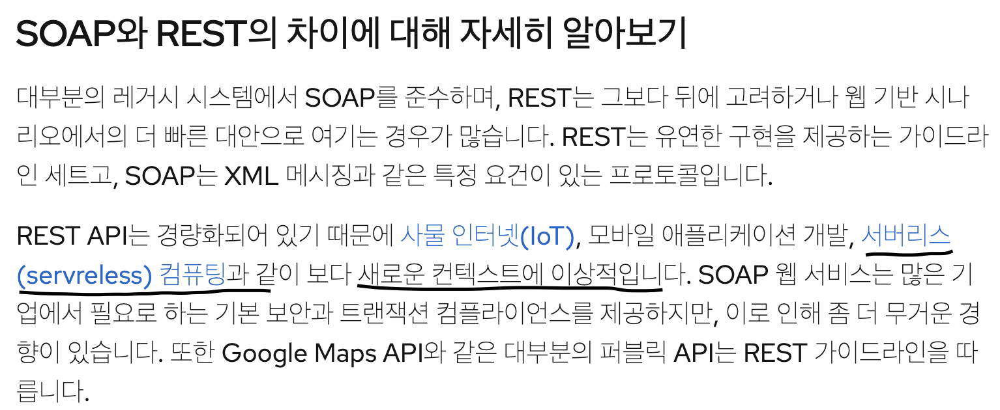

# REST API 

### API와 REST API
> **API란**
- 컴퓨터나 프로그램 사이의 연결이라고 사전은 설명하고 있다. 정확히 무슨 말일까 ? 
- 조금 더 풀어본다면 **일반 API는 서로 다른 소프트웨어 구성 요소가 상호 작용하고 데이터를 교환할 수 있도록 하는 통신 프로토콜이다.** 라고 볼 수 있다.
- 다시 내 머리로 이해하자면 프로그램이 일련의 동작을 하면 거기에 맞는 API가 실행되고 정해진 규약에 따라 데이터가 교환되는 것 자체?를 의미하는 것 같다. 
- 그리고 SOAP, XML-RPC 또는 CORBA 같은 다양한 통신 프로토콜을 사용할 수 있다고 한다. (통신 규약 차이 ?)
- 또한 일반적으로 아래 5가지의 설계 인터페이스로 구성되어 있다.
  1. Communication (통신)
    - API와 클라이언트 간의 정보 교환을 의미하는데 명확하고 일관된 규칙을 정해서 프로토콜이나 데이터 형식을 제공해야 한다.
  2. Specification (사양)
    - 결국 API를 사용하라면 잘 이해해야 하는데, 가이드라인(기능, 데이터 모델 및 인터페이스에 대한 상세 설명 등)을 포괄적으로 정의함으로써 개발자가 해당 API를 잘 사용 할 수 있도록해야 한다.
  3. Information Hiding - Principle : (정보 은닉 - 원칙)
    - API의 내부 로직은 최대한 노출이 되지 않는 목표로 설계하는 원칙이다.
    - 클라이언트가 상호 작용을 할 수 있는 간단한 인터페이스를 제공함으로써 클라이언트에게 영향이 가지 않도록 구현 내용을 변경할 수 있다는 의미이다.
  4. Encapsulation - Technique : (캡슐화 - 기술)
    - API가 사용자랑 상호 작용을 하는데 필요한 데이터만 노출시키고 내부 작동 방식은 숨긴다... (정보은닉이랑 똑같은거같은데 ?)
    - 내가 아는 캡슐화는 외부에서 내부 데이터의 수정을 방지하기 위해 캡슐화라는 것을 한다고 들었다. 
    - 또 코드를 캡슐화 함으로서 모듈성을 갖출 수 있고 재사용성이 생긴다.
    - 그래도 중점은 데이터 보호 즉, 외부에 의한 조작 방지를 위한 보안기법?정도로만 우선 알고 있자.
  5. Implementation (구현)
    - 말 그대로 API의 기능을 구현하기 위한 코드나 소프트웨어를 지칭한다. 대신 시간이 지나도 변경이나 업데이트가 잘 되도록 구성하고 유지 관리가 용이해야 한다. (디자인 패턴이나 컨벤션 등이 적용될 수도 있음)

> **REST API란?**
- 이해한바에 따르면 HTTP 프로토콜 위에 아키텍처를 따로 적용하여 API를 개발하는것을 칭하는 것 같다.  
- API와 같이 프로그램 사이에서 데이터를 교환하여 통신하는것은 동일하다. 
- 대신 그 안에 REST만의 아키텍처를 적용한 것 같다. (아래 7개의 제약 조건을 따른다.)
  1. Starting with the Null Style
  2. Client-Server
  3. Stateless
  4. Cache
  5. Uniform Interface
    - 독립적인 진화를 위해 만들엇다고 합니다. 서버와 클라이언트가 각각 독립적으로 진화한다. 독립적인 진화란, "서버가 바뀌어도(API 가 추가되고, 변경되어도) 클라이언트가 변경할 필요가 없다
  6. Layered System
  7. Code-On-Demand

### API와 REST API의 차이점
1. 데이터 형식의 차이
  - API의 데이터 형식은 다양하지만 REST API는 일반적으로 JSON과 XML을 사용한다. (나는 JSON을 사용한다. 프론트랑 소통하기에도 편하고 실무에선  JS개발을 하고 있기 때문에)
2. 프로토콜의 차이
  - REST API는 HTTP 프로토콜을 사용한다. 
  - HTTP 한가지만 사용하기 때문에 더욱 규약에 집중할 수 있고 HTTP를 HTTP답게 쓰려고 만든 것? 이라는 말이 어느정도 일리가 있는것 같다. 
  - API는 SOAP나 CORBA 등과 같은 통신 프로토콜을 사용할 수 있다.
3. 접근 방식의 차이 
  - REST API는 URL로 식별되는 리소스 기반 접근 방식이다.
  - API는 리소스를 식별하고 주소를 지정하기 위해 다른 접근 방식을 사용할 수 있다.
4. Stateless 차이
  - HTTP는 기본적으로 무상태 프로토콜이다. REST API는 HTTP를 사용하기 위한 아키텍처 스타일?이니 요청할때 상태가 저장되어 있지 않거나, 상태를 포함해서 요청을 해야한다. 
  - API는 요청 간에 일부 상태 정보를 유지할 수 있다.
5. 유연 및 확장성 차이
  - REST API는 단순성과 유연성, 확장성이 좋다. 
  - REST API는 웹 혹은 모바일 앱과 같은 여러 클라이언트에서 쉽게 통신할 수 있는 API를 생성할 수 있다. 

### Architecture와 Architecture Style의 차이
> - 아키텍처 : 소프트웨어 시스템의 전반적인 디자인
> - 아키텍처 스타일 : 소프트웨어 시스템을 구축하는 데 사용되는 특정 디자인 패턴 또는 규칙 집합

### 서버리스는 왜 REST에 적합한 것일까 ?
- 이번에 REST에 대한 상세 내용을 알기 위해 [REST](https://www.redhat.com/ko/topics/integration/whats-the-difference-between-soap-rest)에서 문서를 읽고 있었는데 서버리스에 대한 내용이 있었다.

- 의문점: 서버리스는 서버가 없는 상태가 아닌가 ? 그래서 문서 상단 내용을 다시 읽어봤는데 RESTfule이 갖춰야할 요소 중 **첫번째인 클라이언트, 서버, 리소스로 구성된 클라이언트-서버 아키텍처가 필요합니다**라는 구문을 보았다.
- 이해가 안갔다 또 상태 유지와 무상태처럼 무상태이지만 세션과 쿠키를 활용하면 상태 유지로 설계할 수 있다 이런 맥락인거 같아서 찾아보았다.
- 결론은 RESTful에서 말하는 클라이언트-서버-리소스 아키텍처는 물리적이 아니라 논리적이기 때문에 가능하다고 한다. 
- 다시 생각해보면 서버리스라는게 용어적으로 서버가 없는 것이지 서버가 아예 없는것이 아니라는것. 쉽게 생각하면 클라우드를 이용하여 플랫폼에서 서비스를 이용하면 그것이 서버리스라는 것 인것같다. (내가 구축하지 않았기 때문?)
- 예를 들어 안드로이드 앱 간단한거 만들기 위해 구글클라우드 Firebase를 사용하듯이 ....

## 학습 키워드
- API(Application Programming Interface)
- 정보은닉(Information Hiding)과 캡슐화(Encapsulation)
  - 그리고 이 둘의 차이(많이들 혼용하니까 잘 알아두세요)
- Architecture와 Architecture Style의 차이
- REST(7가지 제약 조건 위주로 정리)
  - 교재에 나온 `필딩 제약 조건`을 좀 더 풀어서 정리해보세요.
  - 아래 2가지 자료를 보시면 도움이 되실 겁니다.
  - [https://www.youtube.com/watch?v=RP_f5dMoHFc](https://www.youtube.com/watch?v=RP_f5dMoHFc)
  - [https://blog.npcode.com/2017/03/02/바쁜-개발자들을-위한-rest-논문-요약/](https://blog.npcode.com/2017/03/02/%eb%b0%94%ec%81%9c-%ea%b0%9c%eb%b0%9c%ec%9e%90%eb%93%a4%ec%9d%84-%ec%9c%84%ed%95%9c-rest-%eb%85%bc%eb%ac%b8-%ec%9a%94%ec%95%bd/)
  - [https://blog.npcode.com/2017/04/03/rest의-representation이란-무엇인가/](https://blog.npcode.com/2017/04/03/rest%ec%9d%98-representation%ec%9d%b4%eb%9e%80-%eb%ac%b4%ec%97%87%ec%9d%b8%ea%b0%80/)