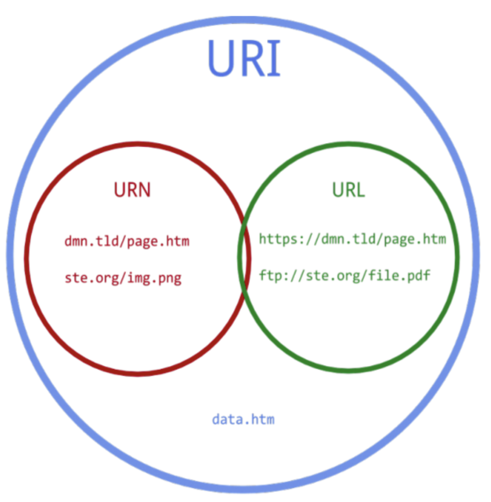

# URI & MIME type

### URI
<!--  -->

   
- 특정한 리소스를 식별하는 통합 자원 식별자의 의미를 가진다. 
- 또 리소스를 표현하기 위해 2가지로 나눌 수 있다.
- 통합이라는 의미는 URI안에 서브셋인 URL과 URN이 존재해서 그런것 같다. 
> URN은 들어만 봤지 실제 사용 사례는 본적이 없어서 알고있는 정도로만 퉁치려고 한다. 
   
- URI와 URL은 어떤 차이점이 있는 것일까 ? 우리가 흔히 보는 URL은 어떤 것인지 잘 알 수 있는데 URI랑도 구분이 되지 않은것 같아서 더 헷갈린다. 
- 종종 같은 의미로 사용해서 그런지 구분이 쉽게 가지가 않는데, URI는 URL과 URN 모두 포함되고 URL은 URN과 다른 표현법을 가지고 있으니 어떻게 보면 다르다고도 할 수 있을것 같다.
> 예시를 찾아보면 "www.example.com"의 URL은 "http://www.example.com/index.html" 된다. (**리소스가 구체적이다.**)

### MIME Type(Content Type)
- 이것은 주로 HTTP Header에다가 작성하는 것으로 알고 있다.
- 클라이언트가 서버에 요청할때 어떤 형식인지 스펙을 적는다. 서버도 응답을 해줄때 똑같이 스펙을 적어서 보내준다.  
- **리소스의 표현 형태**이다.
- 내가 자주 사용하는 것은 application/json과 multipart/form-data이다. 

```
Content-type: application/json

Content-type: text/html
```
> 이런식으로 HTTP 헤더에 추가로 작성해줄 수 있다.
   
> 꼭 이 방법만 있는건 아니고 URL에도 형식이 어떤건지 작성할 수 있는데, 헤더에다가 기술하는게 일반적으로 많이 쓰인다고 한다.


#### [중간]
> - 개념적인 내용이었는데, 우선 URI가 무엇이고 URL과 URN이 무엇인지까지는 어렵지 않았던것 같다.
> - 요청 본문에 Content-Type을 실어보내는 것을 많이 봐왔는데 타입별로 쓰임새를 알아봐야겠다. 형식은 많이 사용하는만 알아도 될 것 같은 ?

학습 키워드
* URI & URL & URN
* MIME type