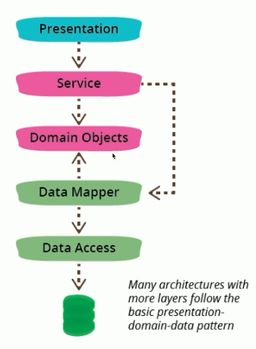
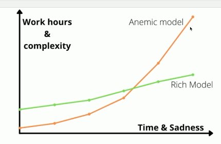
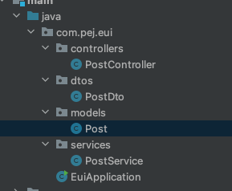
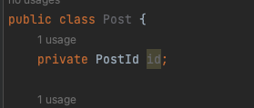

# Domain Model

### 도메인 ?
- 도메인이라는 의미는 상황에 따라 다르게 사용되기 때문에 이번 주차에서 사용되는 **도메인** 즉, 설계 혹은 패턴이나 아키텍처 면으로서 알아본다.
- 먼저 이전 3계층 구조에서는 딱히 도메인이라는 용어대신 응용(서비스)계층과 데이터 계층의 비중이 크다고 본다. `프레젠테이션 -> 서비스 -> 데이터`로 구분지었다. 
- 이번에는 도메인이라는 개념을 인지하여 4계층으로 구성된 도메인 주도 개발의 기본을 배우게 되었다.
- 도메인은 쇼핑몰을 예를 들어서 이 쇼핑몰을 구축하는데 필요한 상품 조회, 구매, 결제 등등의 기능이 있어야한다.
- **이렇게 쇼핑몰은 소프트웨어(혹은 프로그램)로 해결하고자 하는 문제 영역으로 인식하고 이런 것이 도메인에 해당된다.**
  - 이런 도메인은 하위 도메인으로 구성할 수 있다.

### 도메인 모델
- 도메인이 해결하고자하는 문제의 영역이고, 도메인을 하위 도메인들로 구성할 수 있다면, 도메인 모델은 우리가 해결하고자하는 특정 도메인을 개념적으로 표현한 것이라고 한다.
- 예를 들어서 상품 도메인이라고 생각하면 `상품에 필요한 기능이나 데이터의 구성을 파악`한다.
- 도메인 모델을 표현하는 것들은 여러가지가 있는데, 보통 객체 기반이나 상태 다이어그램으로 표현을 한다.
- 도메인 모델은 도메인 자체를 이해하기 위한 개념적 모델이라고 한다.
- 우리가 구축하려는 시스템에 대한 주요 개념, 관계를 식별하고 명확하게 하는데 좋다.

### 우리가 자바에서 적용하고자 하는 도메인 모델 혹은 DDD의 기초

- 우리는 지금까지 (응용 + 도메인)을 묶어서 처리하고있었다.
- 사진에서 보는 바와 같이 도메인 레이어를 따로 구성하여 도메인 모델만 따로 관리하는 층을 만든다.
  - 결국, DDD라는 것은 도메인 레이어, 객체를 따로 관리(혹은 분리)를 해줌
  - 모델 계층이라고도 함.

#### 이걸 왜 만드는 걸까 ? 
- 프로그램이 거대해지고 코드의 복잡성은 증가하기 마련(그렇게 하기 싫어도 결국은 이렇게 됨)
- 이런 **프로그램을 그대로 두면 나중에 확장하기에도 어렵고 유지보수가 까다로울것**이다. 
  - 프로그래밍의 기본 중 하나 유지보수와 확장성이 쉬워야한다. (어렵다..)
- 사람이 변하면서 잘못된 점들을 개선하듯이 프로그램도 비슷한거같다. 늘 개선 방법을 찾고 공부해나가는 것이 개발자의 숙명이 아닐까..

#### 우선 도메인 계층을 적용함으로써 애플리케이션 레이어 특징을 알아보자 
- 얇게 유지 (거의 있는게 없어야함)
  - `어 뭐야 도메인 너 왜 뺏어가`
- 업뮤 규칙이나 지식이 포함되지 않음
  - `이제 여기서 뭔가 작업을 하지 않는다.`
  - `이런 순서로만 해주세요` 정도
- 작업을 조정
- 도메인 객체의 협력자에게 작업 위임
  - 도메인 객체들한테 `너네가 이거 이렇게 알아서해줘라`

> - 특히 도메인 모델은 행위를 가장 중요시 한다고 한다. (유닛 테스팅하기 적합한 존재)
   

아샬님이 알려주신 코드 예시를 보자.
   
**행위 없이 코딩하는 경우다.**
- 내가 할테니까 너가 가지고 있는게 뭐야, 협력이 아님, 복잡성 증가
```java
Long amount = account.getAmount(); // 계좌 남은 금액 얻기
account.setAmount(amount + 10_000);
```
   
**행위를 포함**
```java
account.increateAmout(10_000);
```
- 내부에서 뭘하든 내가 알지 않는다. -> 다른애한테 위임해준다.
   
### Repository
- 3계층의 DAO는 데이터관리 즉, DB와의 연결을 많이 한다. **(DB 중심)**
- 4계층의 도메인 레이어 중 레포지토리는 도메인 모델 관리한다. **(도메인 중심)**
  - 대신 JPA의 레포지토리는 DAO를 의미

#### Data Mapper
- 일반적으로 도메인 모델과 DB 사이의 데이터를 매핑하는 데 사용되는 패턴이라고 한다.
- 도메인 모델을 인프라와 독립적으로 유지 보수, 테스트 가능성과 유연성을 향상시키는데 좋다.
- JPA 레포도 도메인 데이터 매퍼의 특수형태 
  - DDD를 실용적으로 하는 곳에선 도메인 Entity와 JPA를 잘 버무려 사용한다.

#### 기존 데이터 베이스 주도 개발
- ERD를 먼저 그림, DAO와 VO(DTO)를 사용하는 방식
- 애플리케이션 레이어에서 뭘 안하지만 이런 방식을 사용하면, 도메인 모델이 없기 때문에 사실상 DTO만 존재 그래서 set, get을 사용함 
- DB 스키마에 맞춰서 뭔가를 조작
(우리는 데이터 베이스 주도 개발이다....)

#### DDD (도메인 주도 개발)
- 도메인 모델 만들기
- JPA 모델 만들기 
- 둘이 완전히 달라도 됨
- DB 조정을 위해 CQRS, Event Sourcing 사용 (모델 분리)
- 솔루션 자체를 변경하기 쉬움(상대적으로)
  - 예를 들어 MySQL(RDB) -> NoSQL
   
> - 데이터 베이스 주도 개발은 DB가 바뀌면 프로그램이 바뀜
> - DDD는 프로그램을 먼저 고치고 DB를 변경 (또한 DDD는 DB 변경을 최소화 할 수 있다고 한다.)
!!! 어디에 무게를 두느냐가 중요


#### 도메인 모델에 대해 무기력하거나 풍부에 대해
- 행위 없는 데이터를 다루지마라 (안티패턴)
  - 처음에 이것이 무슨 말인지 이해가 안갔는데 이번 강의를 통해 어느정도 감이 왔다. 다행이다.
- 근데 기존 방식은 코드양이 적다는 장점이 있다.
  - 즉 못써먹을 정도는 아니다.
- 당장은 무기력한 모델로 만들지만 그 후 점차 전환하여 풍부하게 만든다.


   
> - `그래도 우리는 앞으로 DDD나 풍부한 도메인 모델을 다루는 걸 연습하고 적응해야한다.`
> - DB에 많이 끌려다니지 말자.


### 도메인 모델 실습

- DAO 대신 models 패키지 폴더 생성한다.
- 여기서 도메인 모델을 관리하고 구조를 만든다.
   
- 기본 구성은 이렇다 그런데 그냥 이대로 하면 도메인 모델로써는 너무 취약하고 DTO와 다를바가 없다.
``` java
public class Post {
    private Long id;

    private String title;

    private String content;

    public Post(Long id, String title, String content) {
        this.id = id;
        this.title = title;
        this.content = content;
    }
}
```
   
- `유용하게 사용해보자`
- 도메인 모델로 적용
- 아래와 같이 Post를 구성하는 필드도 도메인 객체로 분리한다.
   

   
!객체지향
```java
public class PostId {
    private String id;

    public PostId(String id) {
        this.id = id;
    }

    @Override
    public boolean equals(Object o) {
        if (this == o) return true;
        if (o == null || getClass() != o.getClass()) return false;
        PostId postId = (PostId) o;
        return Objects.equals(id, postId.id);
    }

    @Override
    public int hashCode() {
        return Objects.hash(id);
    }
}
```
- VO 값이 같은지 안같은지 확인(데이터가 일치한지 안한지 정도)
   
- `Post 모델의 content 필드를 도메인 객체로 적용`
```java
public class MultilineText {
    private final List<String> lines;

    public MultilineText(String text) {
        this.lines = Arrays.asList(text.split("\n"));
    }

    @Override
    public String toString() {
        return lines.stream().collect(Collectors.joining("\n"));
    }

    @Override
    public boolean equals(Object o) {
        if (this == o) return true;
        if (o == null || getClass() != o.getClass()) return false;
        MultilineText that = (MultilineText) o;
        return Objects.equals(lines, that.lines);
    }

    @Override
    public int hashCode() {
        return Objects.hash(lines);
    }
}
```
   
#### 도메인 객체를 풍성하게
- Post를 풍성 하게 만들기 위해 Post를 이루는 것들을 하위 도메인으로 분리하는 것 같다.
- 그리고 도메인 레이어랑 애플리케이션 레이어를 구분을 해준다.
  - **그러니까 service 레이어에선 find를 할때 도메인 모델을 얻게 한다.**
  - 기존에는 service 레이어에서 find를 하면 DAO를 통해 가져왔다.
  - DAO는 도메인 모델이 아니기때문 

#### Repository 레이어를 생성
- 도메인 객체에 접근하고 관리하기 위한 컬렉션과 같은 인터페이스를 제공하는 데 사용되는 패턴이다.
- 도메인 모델과 데이터 액세스 계층 간의 문제를 명확하게 분리하여 애플리케이션의 유지 관리성과 유연성을 향상
- 일반적으로 만들기, 읽기, 업데이트, 삭제 및 쿼리 작업과 같은 도메인 개체에 액세스하고 관리하기 위한 메서드를 정의하는 인터페이스로 구성된다고 한다. (service의 2단계 느낌 ..?)
- 구현 시 SQL, NoSQL 또는 ORM(개체 관계형 매핑) 프레임워크와 같은 적절한 기술을 사용할 수 있다.
- 결국은 `controller -> service -> repository + domain -> data` 이렇게 보는게 맞는건가 ..? 

### 설계 고려사항   
- 주의할 점은 getter는 절대 비즈니스 로직을 위해 사용하지 말것.
- service에서 로직을 구현할 필요없음 
- 레이어를 나누는것 (초보적 수준)
  - 응용 , 도메인


## 학습 키워드
- Domain Model 이란
- Repository
- VO(Value Object)