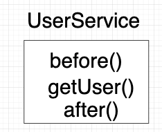
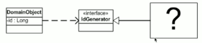

# Dependency Injection


### 스프링의 주요 개념을 알아보자

#### DI (Dependency Injection)
- 스프링에서 상당히 맞닿아 있는 부분이 많다.
- 보통 이것을 IoC랑 엮어서 얘기하는 부분이 많은데 엄밀히 말하면 서로 밀접하지만 둘은 차이점이 존재한다.
- 우선 DI는 `의존성 주입`이다. 스프링의 핵심 기능이며, 소프트웨어 애플리케이션에서 객체 간의 종속성을 관리하는 방법이다.
	- 의존하는 책임을 제거하여 클래스들간의 결합도를 낮추는 것을 목표로 하는 디자인 패턴이라고 한다.
- 우리는 보통 객체 인스턴스를 생성할때 `new` 키워드를 사용한다. 즉, 객체 자체에 의해 생성되거나 획득하는게 아니라 객체의 종속성이 객체에 주입된다. 
	- 내가 이해한바는 한 클래스에서 다른 클래스를 생성한 다음에 생성한 클래스를 이용해서 뭔가를 한다는 느낌보다. 다른 클래스를 조립해서 만든다 ? 라는 의미로 생각하고 있다. (이게 무슨 차이가 있을까는 알아봐야겠다.)
- 스프링 프레임워크는 DI를 쉽고 편하게 해준다. 이것이 프레임워크의 힘이다. 

##### 장점
- 이또한 객체를 분리하고 모듈식 및 재사용 가능한 코드를 촉진한다는 것
- 종속 클래스를 수정하지 않고도 구현을 변경하거나 교체하는 것이 더 쉬워진다.


##### 의존성 주입 방법
- 여러가지 주입 방법이 있는데 우리는 생성자 주입으로 진행할 것이다. (이게 좋다고 한다.)
1. 생성자 주입
	- 종속성은 클래스 생성자를 통해 제공된다.
	- 생성자 매개변수는 필요한 종속성을 나타내며 프레임워크는 객체를 생성할 때 이를 확인하고 주입한다.
2. Setter 주입
3. 필드 주입
4. 인터페이스 주입 

##### Spring DI 활성방법 
- 이또한 2가지가 있는데 XML 파일 구성과 Java 클래스로 구성을 한다.
- 애플리케이션 컨텍스를 구성하고 Bean(객체)과 해당 종속성을 정의하면 프레임워크가 얘네들을 인스턴스화하고 연결한다.


##### 왜 생겨났을까 
- 느슨한 결합과 객체 생성 관리 문제를 해결하기 위해 개발되었다고 한다. 
- DI라는 것이 나오기 이전에는 객체가 종속성을 생성하고 관리하는 역할을 했기에 코드가 밀접하게 결합(결합도 상승)되어 유지 관리나 테스트 및 재사용이 어려웠다. 
	- 결국 유지 보수와 클린코드를 위해 발전해 나간것이다. (효율업업)

#### AOP (Aspect Oriented Programming : 관점 지향 프로그래밍)
- 개발자가 개발한 어떠한 로직을 기준으로 핵심, 부가적 관점으로 나누어 보고 이 관점을 기준으로 모듈화한다는 의미
- 한마디로 개발자의 관점에서 프로그래밍을 한다? 라고 이해하면 될 것 같다. 
	- `어떤 로직에서 실행시간이 얼마나 걸리는가에 대해서는 개발자만 알면되니까.`
- 스프링에서는 AOP를 위한 어노테이션을 지원한다.
- 거의 직접 구현하진 않는다고 한다.
- 아래의 사진은 이해하기 편할 것 같다.
	- AOP를 적용하면 어떤 로직의 실행 전과 실행 후 그리고 그 사이에 메인 로직이 들어감.
   

   
##### 왜 생겼을까 ?
- 소프트웨어 개발에서 교차 절단 문제를 해결하기 위해 만들어졌다고한다. 
- 교차 절단 문제는 응용 프로그램의 여러 부분에 영향을 미치고 기본 논리 모듈 또는 구성 요소를 가로지르는 경향이 있는 기능 또는 특징을 지칭한다. 
- 예로는 로깅, 보안, 트랜잭션 관리, 오류 처리 및 성능 모니터링이 있다.


##### Aspect 
- 핵심 개념은 aspect이라고 한다.
- 특정 조인 포인트(Aspect 동작을 적용해야 하는 애플리케이션의 특정 지점) 및 어드바이스가 적용되어야 하는 조인 포인트를 지정하는 포인트컷에 대해 수행할 작업을 나타내는 일련의 어드바이스를 정의한다.
	- `개발자가 적용할 관점의 포인트를 지정하는 부분같다.`

> 이것또한 코드 중복을 줄이고 관심사 분리를 개선하여 더 깨끗하고 유지 관리하기 쉬운 코드를 위함.
   

### 싱글턴 패턴
#### 싱글턴 패턴이란 ?
- 소프트웨어 설계 디자인 패턴중 하나이다.
    - 올바른 설계를 빨리 만들 수 있도록 도움을 준다.
- 클래스의 인스턴스화를 단일 인스턴스로 제한한다.
	- 객체 인스턴스 생성을 한번만 하고 이것을 전역으로 재사용할 수 있게 공유한다는 것 같다.
- 애플리케이션이 살아있는 동안(라이프 사이클) 생성한 클래스의 인스턴스가 하나만 존재하도록 한다.
	- 스프링은 Bean 안에서 관리되는 객체를 모두 싱글턴으로 생성해준다고 한다. (!!!!)
#### 이 패턴은 왜 사용되는 것일까 ?
- 싱글턴 패턴의 정의 그 자체로 무분별한 객체 생성을 제어하고 클래스의 인스턴스 하나만 생성하여 애플리케이션이 살아있는동안 여러 부분에서 재사용, 공유되도록 하기 위해서다.

#### 싱글톤 패턴의 장점
1. 단일 인스턴스
    - 인스턴스를 하나만 생성하여 전역적으로 공유되도록 보장한다.
2. 전역 액세스
    - 싱글턴 인스턴스는 전역적으로 액세스(접근)이 가능하다
    - 프로그램 전체의 객체가 쉽게 접근할 수 있다.
    - 공통 리소스 혹은 데이터 공유를 단순화 시킨다.
3. 리소스 관리
    - 단일 제어 지점이 있어야 하는 리소스를 관리하는 데 사용할 수 있다.
    - 데이터 연결 풀(커넥션 풀?)을 싱글턴으로 구현하면 리소스를 효율적으로 사용할 수 있다.
4. 지연 초기화
    - 처음 요청이 될 때만 생성된다.
    - 실제로 필요할 때까지 불필요한 인스턴스화를 방지한다.
5. 스레드 안전성
    - 스레드로부터 안전하도록 설계할 수 있다. 
    - 여러 스레드가 충돌 같은 것 없이 싱글턴 인스턴스에 접근하고 사용가능하다.

#### 싱글턴 간단한 사용 예
- 로깅 서비스 같은 경우
- 이를 싱글턴으로 구현하면 애플리케이션의 모든 구성 요소가 동일한 로깅 인스턴스에 접근하고 사용가능하다.
   
* 아래는 강의에 나온 팩토리에 관련한 내용을 싱글턴으로 구현한 예제이다.
```java
public class Factory {
    private static PostRepository postRepository;

    public static PostRepository postRepository() {
        if (postRepository == null) {
            postRepository = new PostRepository();
        }
        return postRepository;
    }
}
```

* 위의 예시를 참고하여 로깅 인스턴스를 사용할 객체를 간단하게 구현하면 아래와 같은 형태가 될 수 있다.
```java
public class Logger {
    private static Logger instance;
    
    private Logger() {
        // 직접 인스턴스화를 방지하기 위함.
    }
    
    public static Logger getInstance() {
        if (instance == null) {
            synchronized (Logger.class) {
                if (instance == null) {
                    instance = new Logger();
                }
            }
        }
        return instance;
    }

    public void log(String message) {
        System.out.println(message);
    }
}
```

* 다른 객체에선 아래와 같이 로깅 인스턴스를 사용할 수 있다.
```java
Logger logger = Logger.getInstance();
logger.log("Log Test");
```

### IoC(Inversion of Control): 제어의 역전
- **소프트웨어 애플리케이션에서 제어 흐름의 반전을 나타내는 설계 원칙**
- 응용 프로그램이 의존하는 객체를 생성하고 관리하는 대신 제어가 반전되어서 외부나 프레임워크에 위임되는 것을 의미한다.
    - 스프링 프레임워크에서 Spring Bean으로 객체관리를 해주는 사례를 보자. 
- 프레임워크는 종속성을 생성, 관리 및 응응 프로그램 객체에 주입하는 일을 담당한다.

#### 왜 사용할까 ?
- 구성 요소 간의 결합를 낮추는 것을 달성하고 소프트웨어 애플리케이션의 모듈성과 유연성을 개선하는 데 사용한다.
- 관심사의 분리를 빠르게 나아가고 유지보수, 테스트 및 재사용을 더 쉽게 할 수 있다.
- 객체 생성 및 종속성 관리의 책임을 프레임워크에 위임함으로써 IoC는 애플리케이션 코드 내의 복잡성과 종속성을 줄이는 데 도움이 된다.

#### 장점
1. 분리
    - 종속 객체에서 객체 생성 및 종속성 관리 책임을 제거하여 구성 요소 간의 연결을 느슨하게 달성하는 데 도움이 된다.
    - 이렇게 하면 응용 프로그램의 다른 부분에 영향을 주지 않고 개별 구성 요소의 동작을 쉽게 수정, 교체 또는 확장이 용이하다.
2. 모듈성 및 재사용성
    - 객체 생성 및 종속성 관리 문제를 핵심 비즈니스 로직에서 분리하여 모듈식 및 재사용 가능한 코드를 촉진한다. 
    - 그러니까 구성 요소는 종속성이 밀접하게 되지않고 특정 기능에만 집중할 수 있으므로 재사용이 더 쉬워진다는 것을 의미한다.
3. 테스트 용이성
    - 종속성을 모의 객체 또는 테스트 더블로 쉽게 대체할 수 있도록 하여 단위 테스트를 단순화한다. (테스트 더블 : `테스트하려는 객체와 연관된 객체를 사용하기가 어렵고 모호할 때 대신해 줄 수 있는 객체`)
    - 테스트별 종속성을 주입하면 개별 구성 요소의 동작을 독립적으로 확인할 수 있으므로 코드의 테스트 가능성이 향상된다.
4. 유연성 및 구성 가능성
    - 애플리케이션 동작의 런타임 구성 및 조정을 할 수 있다.
    - 종속성의 연결은 구성 파일이나 코드를 통해 쉽게 조작할 수 있으니 다양한 런타임 환경이나 변화하는 비즈니스 요구 사항에 유연하게 적응할 수 있다.
5. 병렬 개발
    - 구성 요소를 독립적으로 개발하고 나중에 IoC 컨테이너를 통해 통합할 수 있도록 하게 하여 병렬 개발을 가능하게 한다.
    - 서로 다른 팀이나 개발자가 서로 직접 결합하지 않고 별도의 구성 요소에서 작업할 수 있으므로 효율적인 개발 프로세스가 가능하다.

#### 사용예제
- IoC 컨테이너를 제공하는 Spring Framework를 사용하면 쉽게 확인이 가능하다.
- 서비스 클래스가 데이터베이스와 상호 작용하기 위해 리포지토리 클래스에 의존하는 시나리오를 찾아보았다.

```java
public class PostService {
    private PostRepository repository;

    public PostService(PostRepository repository) {
        this.repository = repository;
    }

    public List<Object> getPosts() {
        return repository.getPosts();
    }
}
```

- 일반적인 프로그래밍에서 PostService 클래스는 내부적으로 PostRepository 인스턴스를 생성하는 역할을 한다. 
- 그러나 IoC를 사용하면 종속성을 만들고 관리하는 책임이 프레임워크에 위임되는 것이다.

> Spring Framework를 사용하면 구성을 통해 종속성을 관리할 수 있다.

* Configuration
- 특정 어노테이션이 있는 클래스를 찾아서 빈으로 등록해주는 컴포넌트 스캔 기능을 제공한다.
- 스프링은 컴포넌트 스캔(Component Scan)을 사용해 @Component 어노테이션이 있는 클래스들을 찾아서 자동으로 빈 등록을 해준다.
- 아래의 코드는 AppConfig 클래스는 Spring IoC 컨테이너가 관리할 빈(PostRepository 및 PostService)을 정의한다.
- 컨테이너는 의존성을 생성하고 주입하는 역할을 합니다.

```java
@Configuration // @Bean을 사용하기 위한 어노테이션
public class AppConfig {
    @Bean
    public PostRepository postRepository() {
        return new PostRepositoryImpl();
    }

    @Bean
    public PostService postService(PostRepository repository) {
        return new PostService(repository);
    }
}
```


* 위에서 구성한 객체들은 애플리케이션의 다른 위치에서 컨테이너에 등록된 PostService 얻을 수 있다.

```java
public class Main {
    public static void main(String[] args) {
        ApplicationContext context = new AnnotationConfigApplicationContext(AppConfig.class);
        PostService service = context.getBean(PostService.class);
        service.getPosts();
    }
}
```

### DI와 IoC 차이점?
- DI와 IoC를 알아보다보면 둘이 상당히 비슷한것을 알 수 있다. 강의에서도 그렇고 둘은 비슷하지만 다른점이 있다고 한다. 그래서 사례를 좀 찾아보았다.
- IoC(Inversion of Control) 및 DI(Dependency Injection)는 소프트웨어 개발에서 밀접하게 관련된 개념이지만 서로 다른 의미를 가지며 시스템 설계 및 아키텍처의 다양한 측면에 중점을 둔다고 한다.
   
#### IoC
- IoC는 객체 생성 및 관리의 제어를 외부 엔터티 또는 프레임워크로 반전시키는 **전반적인 원칙 또는 디자인 패턴**을 나타낸다.  
- 의존성 주입(Dependency Injection)과 같은 다양한 기술과 메커니즘을 포함하는 상위 개념이다. (아 DI가 IoC안에 포함되는 것이었구나)

#### DI
- 종속성 주입(DI)은 IoC를 달성하는 데 사용되는 특정 구현 기술 또는 메커니즘이다. 
- 클래스 또는 구성 요소가 외부 소스에서 필요로 하는 종속성(개체 또는 리소스)을 제공하는 방법. 
- 일반적으로 클래스가 직접 생성하거나 가져오도록 하는 대신 종속성을 클래스에 주입한다.

IoC와 DI
IoC는 프레임워크의 공통적인 특징 
<J2EE development without EJB>
POJO를 사용해야한다. 

Spring 등이 EJB를 비판하면서 POJO, IoC Container를 이야기 했고 이전쟁을 끝내기 위해 마틴파울러가 새로운 용어를 제안함 
- 나는 UI에서 했던건데 오해가 크네 ….
- 스프링이라던가 여러가지가 IoC를 사용하고 있어서 스페셜해 -> 내차는 특별하다 바퀴가 있기 때문에
- 프레임웤이면 당연히 IoC해야하는거다 ..
- 그래서 DI가 나옴

- 실제로는 IoC랑 DI가 거의 차이 없이 사용되긴 한다더라
- URI랑 URL이랑 비슷함.
	- 다만 URN을 많이 사용하지 않으니 
- 깐깐한 사람들은 그렇게 사용하면 안됨, 심지어 공식문서도 틀렸다는 사람이 있음 .
- 대부분은 동의어처럼 사용함. 

예전에는 스프링 개발자들이 Property 주입(Setter Injection)을 많이 썼지만 (Java Bean의 흔적)
최근에는 생성자 주입을 선호, 특히 final 필드로 만들어서 사용하는 걸 강력히 권장함. 

> **결론적으로 IoC는 원칙혹은 패턴이며 이 패턴을 달성하는데 사용하는것이 DI라고 인지하면 될 것 같다. (기술[DI]을 가지고 설계[IoC]를 한다.)**


### Spring Bean
- Spring IoC 컨테이너에 의해 관리되는 객체
- Spring 컨테이너에 의해 인스턴스화, 조립 및 관리되는 객체를 지칭하는 데 사용되는 용어
- Bean은 Spring 애플리케이션의 빌딩 블록이며 애플리케이션을 구성하는 다양한 구성 요소 및 서비스를 나타낸다.
- 일반적으로 XML 구성 파일, Java 주석 또는 Java 기반 구성 클래스와 같은 메타데이터를 사용하여 Spring 컨테이너 내에서 정의 및 구성됨. 
    - 메타데이터는 bean 생성 방법, 종속성 및 bean과 관련된 추가 구성 또는 동작을 지정한다.

#### 특징
1. 라이프 사이클 관리
    - pring은 생성, 초기화 및 소멸을 포함하여 빈의 수명 주기를 관리
2. 종속성 주입
    - 빈은 종종 다른 빈이나 리소스에 대한 종속성을 가지며 Spring은 이러한 종속성을 빈에 주입하는 것을 용이하게 한다.
3. scope (범위)
    - Bean은 수명 주기와 가시성을 정의하는 다양한 범위를 가질 수 있다.
4. AOP 지원
    - Spring Bean은 AOP(Aspect-Oriented Programming) 기능으로 쉽게 향상될 수 있다.

> Spring Bean은 Spring IoC 컨테이너에 의해 관리되는 객체이며 Spring 애플리케이션 내의 구성 요소 및 서비스를 나타냄.

### BeanFactory 
- Bean의 구성 및 관리를 제공하는 Spring Framework의 핵심 인터페이스
- Spring IoC 컨테이너의 중심 구성 요소이다.
- BeanFactory 인터페이스는 이름이나 유형으로 빈을 검색하고, 빈 라이프사이클을 제어하고, 빈 종속성을 처리하는 방법을 포함하여 빈 관리를 위한 계약을 정의한다.
- 인터페이스이며 XML 기반 XmlBeanFactory(최신 버전에서는 더 이상 사용되지 않는다고 한다.) 및 어노테이션 기반 ApplicationContext와 같은 다양한 구현을 Spring에서 사용할 수 있다. 
    - 이러한 구현은 Bean 관리 및 액세스를 위한 다양한 기능을 제공

> BeanFactory는 Bean을 관리하고 이에 대한 액세스를 제공하는 핵심 인터페이스

#### 정적 팩토리 메소드 
- 객체를 만드는 것들에 대한 것을 이야기함
- 메서드 하나, 메소드를 모아놓은 오브젝트일 수 있음
- 팩토리 오브젝트

##### 무엇?
- 객체를 직접 만들지 않고 객체를 생성하는 책임만 가진 객체를 만들어서 쓴다. (SRP 단일책임원칙)
    - 보통 new를 사용해서 인스턴스 생성한다.
- PostDAO 또는 PostRepository의 구현이 여럿이라 유용하게 사용 가능
- 객체를 모두 팩토리에서 얻는다면, 객체를 관리함으로써 해당 객체를 **싱글턴**처럼 쓸 수도 있다. 

> 구현체가 뭔지 안다
```java
PostListDAO()
```

> 뭔지 모른다.
```java
PostDAO 
this.postDAO = factory.getPostDAO(“map, hash, list 등”);
```
- factory 의존성은 있긴한데 그 안에서 뭐하는지 모름 

#### 이런 것들에 대한 책임을 모르게 하고 싶다면..
- 이런 구성이 될 수 있다.
`factory.getPostRepository`

- Factory 클래스 생성 (전역으로 접근하기위함 )
    - 서로 다른 클래스 이지만 팩토리를 사용하여 전역객체로 돌려쓰게 한다 ? 
    - 같은 팩토리에서 얻으니까 객체 공유 가능 
   
- 싱글톤 패턴을 사용하면 instance of 메서드 사용
   
- postRepository에서 싱글톤인지는 정해져 있지 않다. 
- 다만 팩토리를 쓸때 싱글톤처럼 되는 것이다.
!! 그리고 서로 모르게 분리한다. 
   
- 팩토리안에 postRepository를 postDao로도 가능하다. (hash, map, list , … ) 이렇게 번갈아가며 사용가능 
- 이런거를 플러그라고한다. 
   


   
이렇게 인터페이스를 만든다.
도메인 옵젝 : 서비스에 해당 
- 서비스 객체가 다오 인터페이스를 보는데 그거를 구현한 무언가 ? 
- 그 무언가를 도메인 옵젝은 모른다는 것이다. 

## 학습 키워드
- Spring AOP(Aspect Oriented Programming)
- Dependency Injection
- 싱글턴 패턴
- 싱글턴이 생겨난 이유, 어떻게 발견 ?
- IoC(Inversion of Control)
- Spring Bean
- BeanFactory


[](https://hits.sh/p-ej.gitbook.io/devroad-backend/megatera-backend/introduction/)