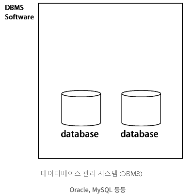
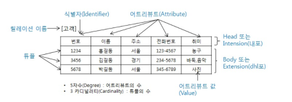

# Database

### 들어가기에 앞서
- 우리는 실습을 여태 자바 애플리케이션 내의 객체를 이용하여 데이터를 저장했다.
- 하지만 이는 애플리케이션이 재시작되면 기존의 데이터는 보관이 안된다.
- 중요한 데이터는 당연하게 없어지면 안되듯 혹은 보안이 필요하면 우리는 데이터를 저장할 방법을 모색해야한다.
- 이를 이용한게 Database이다.
   
#### DB가 필요한 이유
- 데이터를 어디엔가 저장하고 싶을때, 혹은 잃어버리면 안되는 데이터일때
- 데이터는 무엇이든 될 수 있다. (고객 정보, 제품, ... 등등)
    - 또한 데이터들은 텍스트형식, 숫자, 문서 파일, ... 등등 일 수도 있다.
    - 엑셀이 데이터베이스가 될 수도 있다.
   
#### 실제로 데이터 베이스가 언제 필요할까 ?
- 크게 통틀어서 아래 항목들의 상황을 고려해본다.
1. 크기
    - 수천 또는 수백만의 고객 정보가 있을 수 있다.
2. 정확성
    - 잘못된 데이터
    - 실제로 하다보면 잘못된 데이터를 입력하는 것을 막을 수 없다.
3. 보안
    - 저장할 데이터가 민감하거나 접근을 제한해야하는 경우
    - 이는 모든 사람에게 공유할 필요가 없다.
    - 혹은 어떤 변경을 수행했는지 추적이 필요할때
4. 여분
    - 중복 데이터로 충돌이 발생하면 반복되지 않는 고유 데이터만 있으면 된다.
5. 중요성
    - 연결이 끊어졌을때 데이터를 잃어버려도 되는 것인지 ?
    - 그게 아니라면.. 당장 DB사용
6. 덮어 쓰기
    - 여러 사람이 동시에 같은 데이터를 덮어 쓰게하면? 
   
> 위 사항중 하나 혹은 모든 사항에 대해 필요한 부분이 있다면 데이터를 안정적이고 안전하게 유지관리 할 필요가 있다. 따라서 데이터 베이스가 필요하다.
   
   
### Database 란?
- **구조화된 형식으로 저장 및 관리되는 그룹화된 데이터 모음이다.**
    - DBMS랑 혼용되면 안된다.
- 대량의 정보를 효율적으로 저장, 검색 및 관리하도록 설계되었다.
- 데이터베이스는 비즈니스, 과학, 교육 등 다양한 영역에서 사용된다.
   
#### 구성
- 데이터는 행과 열로 구성된 테이블로 구성된다.
- 각 행은 레코드 또는 개별 엔티티를 나타낸다.
- 각 열은 데이터의 특정 속성 또는 특성을 정의한다.
    - 데이터베이스에서 User라는 테이블에는 id, name, email 등과 같은 열이 있을 수 있다.
   
#### 특징
- 데이터를 추가, 업데이트, 검색, 삭제하는 매커니즘을 제공한다. (C R U D)
- 또 쿼리 기능을 지원하여 사용자가 특정 기준에 따라 데이터를 검색하고 필터링할 수 있다.
- DBMS의 도움으로 사용자는 DB와 상호작용하여 작업을 수행하며 데이터 무결성과 보안을 유지할 수 있다.
- SQL(구조적 쿼리 언어)를 사용하고 테이블 사이에 미리 정의된 관계가 있는 관계형 데이터베이스와 더 유연한 데이터 모델을 제공한다.
- 비구조, 반구조적 데이터를 처리하는데 적합한 NoSQL DB를 포함하여 다양한 유형의 데이터베이스가 존재한다.

### DBMS(데이터베이스 관리 시스템)
- **사용자 또는 응용 프로그램과 데이터베이스 간의 인터페이스를 제공하는 소프트웨어이다.**
- 데이터베이스의 생성, 유지 관리 및 제어를 용이하게 하여 데이터의 효율적인 저장, 검색 및 조작을 보장한다.
- 물리적 데이터버에스와 최종 사용자 사이의 중간 계층 역할을 하여 기본 데이터 구조나 스토리지 세부 정보를 직접 처리할 필요 없이 데이터베이스와 상호 작용할 수 있다.
- 테이블 생성 및 수정, 데이터 삽입 및 업데이트, 쿼리 실행, 보안 및 액세스 제어 관리와 같은 데이터베이스에서 다양한 작업을 수행하는 일련의 도구 및 기능을 제공한다.
- Oracle, MySQL, SQL server, MongoDB 등이 DBMS다.
   

   
#### 기능
1. 데이터 정의 언어(DDL)
    - 테이블, 관계 및 제약 조건을 포함하여 데이터베이스의 구조와 스키마를 정의할 수 있다.

2. 데이터 조작 언어(DML)
    - 사용자가 데이터베이스에서 데이터 삽입, 업데이트, 삭제, 검색할 수 있다. 
    - 가장 일반적으로 사용되는 SQL은 DML이다.
    > 내가봐도 정말 DML을 제일 많이 사용하는것 같다. (select, update, insert, delete)

3. 데이터 쿼리 및 보고
    - DBMS는 사용자 정의 기준에 따라 특정 데이터를 검색할 수 있는 강력한 쿼리 기능을 제공한다. 
    - 복잡한 쿼리, 집계, 정렬 및 필터링을 지원
    - 또한 DBMS는 종종 맞춤형 보고서를 생성하기 위한 보고 기능을 제공한다.

4. 데이터 무결성 및 보안 
    - DBMS는 데이터의 정확성과 일관성을 보장하는 제약 조건과 규칙을 정의하여 데이터 무결성을 강화한다. 
    - 또한 사용자 인증, 액세스 제어 및 데이터 암호화를 관리하여 데이터 보안 및 개인 정보 보호를 보장한다.

5. 동시성 제어 
    - DBMS는 여러 사용자 또는 애플리케이션의 데이터베이스에 대한 동시 액세스를 처리하여 트랜잭션이 올바르게 처리되도록 하고 충돌이나 불일치를 방지한다.

6. 백업 및 복구
    - DBMS는 데이터베이스를 주기적으로 백업하고 오류 또는 데이터 손실이 발생할 경우 복원하는 메커니즘을 제공한다.

### RDBMS(Relational Database Management System)
- 관계형 데이터베이스
- **데이터가 하나 이상의 열과 행의 테이블(또는 '관계')에 저장되어 서로 다른 데이터 구조가 어떻게 관련되어 있는지 쉽게 파악하고 이해할 수 있도록 사전 정의된 관계로 데이터를 구성하는 정보 모음**
    - 중요한건 `관계`
- 행과 열로 구성된 테이블 형식으로 데이터를 저장, 관리 및 조작하도록 설계되었다.

#### 특징
1. 테이블 구조
    - RDBMS의 데이터는 행(레코드 또는 튜플이라고도 함)과 열(속성이라고도 함)으로 구성된 테이블로 구성됨. 
    - 각 행은 고유한 엔터티 또는 레코드를 나타내고 각 열은 데이터의 특성을 나타낸다.

2. 데이터 무결성
    - RDBMS는 기본 키, 고유 키, 외래 키 및 검사 제약 조건과 같은 다양한 무결성 제약 조건을 지원하여 데이터 무결성을 강화한다. 
    - 이러한 제약 조건은 테이블 간에 규칙과 관계를 부과하여 데이터의 정확성과 일관성을 보장한다.

3. 관계형 작업
    - RDBMS는 데이터 쿼리 및 조작을 위한 강력한 작업을 제공한다. 
    - SQL(구조적 쿼리 언어)은 일반적으로 RDBMS와 상호 작용하는 데 사용된다. 
    - SQL을 사용하면 사용자가 데이터 선택, 삽입, 업데이트 및 삭제와 같은 작업을 수행하고 여러 테이블을 조인하여 정보를 검색할 수 있다.

4. 관계 및 조인
    - RDBMS는 기본 키-외래 키 연결을 통해 테이블 간의 관계를 지원한다. 
    - 이러한 관계를 통해 서로 다른 테이블 간에 연결 및 연관을 설정할 수 있으므로 관련 데이터를 효율적으로 검색하고 분석할 수 있다. 
    - 조인은 이러한 관계를 기반으로 여러 테이블의 데이터를 결합하는 데 사용된다.

5. ACID 속성
    - RDBMS는 ACID 속성을 준수하여 트랜잭션 무결성을 보장한다. 
    - ACID는 Atomicity, Consistency, Isolation, Durability의 약자이다. 
    - 데이터베이스 트랜잭션이 안정적으로 처리되도록 보장하여 트랜잭션 내의 모든 변경 사항이 커밋되거나 커밋되지 않도록 한다.
    > 트랜잭션으로 애먹은 적이 최근인데... 이부분은 아직도 배울게 많다.

6. 확장성 및 성능   
    - RDBMS는 대용량 데이터를 효율적으로 처리하도록 설계되었다. 
    - 인덱싱 메커니즘, 쿼리 최적화 기술 및 캐싱 전략을 제공하여 성능을 향상시키고 데이터에 대한 빠른 액세스를 제공한다. 
    - RDBMS는 증가하는 데이터 및 사용자 요구를 수용하기 위해 수직(하드웨어 리소스 증가) 또는 수평(여러 시스템에 분산)으로 확장할 수 있다.

#### NoSQL과의 차이점
- NoSQL은 데이터, 테이블 간의 관계를 정의하지 않았기 때문에 정해진 스키마가 없다.
- 이로인해 보다 자유롭게 데이터를 저장할 수도 있고 중복 데이터도 허용한다.
    - 예를 들어서 RDBMS에선 데이터를 삽입할때 정해진 컬럼 수에 맞게 데이터를 저장한다. 하지만 NoSQL (몽고디비 같은거)은 데이터 삽입 과정에서도 컬럼을 유연하게 추가, 삭제 할 수 있다. 

### 데이터베이스 언어
- SQL 외에도 특정 데이터베이스 시스템에 특정한 다른 쿼리 언어가 존재한다고 한다. (MQL, RDF, ...)
- 일반적으로 널리 사용되고 우리가 현재 필요한 언어를 알아보자

#### SQL
- **관계형 데이터베이스를 관리하고 조작하기 위해 특별히 설계된 프로그래밍 언어이다.**
- 데이터베이스와 상호 작용하는 표준화된 방법을 제공하여 사용자가 데이터를 정의, 조작 및 검색할 수 있도록 한다. 
- SQL은 다양한 데이터베이스 관리 시스템(DBMS)에서 널리 사용되며 데이터 기반 애플리케이션에서 중요한 역할을 한다.

#### 구성
1. DDL(Data Definition Language: 데이터 정의 언어)
    - 데이터베이스의 구조를 정의하고 관리하는 데 사용된다. 
    - DDL 명령은 테이블, 인덱스, 보기 및 스키마와 같은 데이터베이스 개체를 생성, 변경 및 삭제하는 역할을 한다.
        - CREATE: 새 데이터베이스, 테이블, 보기, 인덱스 또는 기타 데이터베이스 개체를 만드는 데 사용.
        - ALTER: 테이블에서 열을 추가하거나 삭제하는 등 기존 데이터베이스 개체의 구조를 수정하는 데 사용.
        - DROP: 테이블 또는 뷰를 삭제하는 등 데이터베이스 개체를 삭제하거나 제거하는 데 사용.
        - TRUNCATE: 테이블 구조를 그대로 유지하면서 테이블에서 모든 데이터를 제거하는 데 사용됩니다.
        - RENAME: 데이터베이스 개체의 이름을 바꾸는 데 사용됩니다.
   
> 나는 주로 테이블 생성과 삭제 혹은 ALTER로 컬럼 구조를 변경 혹은 추가 등등 할 때 사용한다.
   
2. DML(Data Manipulation Language: 데이터 조작 언어)
    - DML은 데이터 조작 언어를 나타낸다. 
    - 데이터베이스 내에서 데이터를 관리하고 조작하는 데 사용된다. 
    - DML 명령은 데이터베이스 테이블에서 **데이터 삽입, 업데이트, 삭제 및 검색을 담당한다.**
        - SELECT: 지정된 기준에 따라 하나 이상의 테이블에서 데이터를 검색하는 데 사용.
        - INSERT: 테이블에 새 행이나 레코드를 추가하는 데 사용.
        - UPDATE: 테이블의 기존 데이터를 수정하는 데 사용.
        - DELETE: 테이블에서 행이나 레코드를 제거하는 데 사용.

   
3. DCL(Data Control Language: 데이터 제어 언어)
    - 데이터베이스 개체에 대한 액세스 및 권한을 관리하는 데 사용된다. 
    - DCL 명령은 데이터베이스의 보안 측면을 제어하고 인증된 사용자만 적절한 권한을 갖도록 한다.
        - GRANT: 사용자 또는 역할에 특정 권한 또는 권한을 부여하는 데 사용.
        - REVOKE: 사용자 또는 역할에서 이전에 부여된 권한 또는 권한을 취소하는 데 사용.

> DCL은 잘 사용안하는것 같다. 예전에 SQL 대해서 실습할때 정도로만 사용하거나 실무에서는 로컬에서 SQL을 사용할 때 개발, 운영 DB 서버에 루트 계정으로 접근허가 ? 정도로 사용한 바가 있다.

### 데이터 모델(Data Model)
- **데이터가 데이터베이스 시스템 내에서 구성 및 관련되는 방식을 개념적으로 표현한 것**
- 데이터의 논리적 구조와 다른 데이터 요소 간의 관계를 정의한다.
- 데이터 모델은 데이터베이스를 이해, 시각화 및 디자인하는 방법을 제공하고 데이터가 효과적이고 정확하게 구성되도록 도와준다.
1. 개념적 데이터 모델
    - 개념적 데이터 모델은 현실 세계에 대한 인간의 이해를 돕기 위해 현실 세계에 대한 인식을 추상적 개념으로 표현하는 과정이다.
    - 개념적 데이터 모델은 속성들로 기술된 개체 타입과 이 개체 타입들 간의 관계를 이용하여 현실 세계를 표현한다.
    - 예시로는 E-R 모델이 있다.
2. 논리적 데이터 모델
    - 개념적 모델링 과정에서 얻은 개념적 구조를 컴퓨터가 이해하고 처리할 수 있는 컴퓨터 세계의 환경에 맞도록 변환하는 과정이다.
    - 필드로 기술된 데이터 타입과 이 데이터 타입들 간의 관계를 이용하여 현실 세계를 표현한다.

> 데이터 모델링 음... DB 설계를 할때 ERD으로 먼저 테이블 설계를 하곤한다. 개념 -> 논리 -> 물리 단계를 거치는데 거진 통합으로 하는듯한..?

#### 구성
- 개체(Entity)
    - 개체는 데이터베이스에 표현하려는 것으로 사람이 생각하는 개념이나 정보 단위 같은 현실 세계의 대상체
- 속성(Attribute)
    - 속성은 데이터의 가장 작은 논리적 단위로서 파일 구조상의 데이터 항목 또는 데이터 필드에 해당한다.
- 관계(Relation)
    - 개체 간의 관계 또는 속성 간의 관계이다.

#### 관계형 데이터 모델
- **데이터베이스 시스템에서 가장 널리 사용되는 데이터 모델 중 하나이다.**
- 데이터를 행과 열로 구성된 테이블로 구성한다. 
- 또 기본 키와 외래 키를 사용하여 테이블 간의 관계를 나타낸다.
   
##### 구성
1. 테이블
    - 관계형 데이터 모델에서 데이터는 관계라고도 하는 테이블로 구성된다. 
    - 각 테이블은 실제 세계의 특정 엔터티 또는 개념을 나타낸다. 
    - 예를 들어 회사의 데이터베이스에는 직원, 부서 및 프로젝트에 대한 테이블이 있을 수 있다.

2. 행
    - 테이블의 각 행은 모델링 중인 엔터티의 고유 레코드 또는 인스턴스를 나타낸다. 
    - 예를 들어 직원 테이블에서 각 행은 개별 직원을 나타내며 각 열에는 이름, 나이, 직함과 같은 특정 속성이 포함된다.

3. 열
    - 속성이라고도 하는 열은 저장 중인 데이터의 특정 속성 또는 특성을 나타낸다. 
    - 각 열은 모델링 중인 엔터티에 대한 특정 정보에 해당한다. 
    - 예를 들어 직원 테이블에서 열에는 직원 ID, 이름 및 급여와 같은 특성이 포함될 수 있다.

4. 기본 키
    - 기본 키는 테이블의 각 행을 고유하게 식별하는 열 또는 열 조합이다. 
    - 테이블 내 데이터의 무결성과 고유성을 보장한다.

5. 외래 키
    - 외래 키는 다른 테이블의 기본 키를 참조하는 테이블의 열 또는 열 집합. 
    - 엔터티 간의 종속성 및 연결을 나타내는 테이블 간의 관계를 설정한다. 
    - 외래 키는 데이터 무결성을 가능하게 하고 데이터 정규화 개념을 지원한다.

6. 관계
    - 테이블 간의 관계는 기본 키와 외래 키를 사용하여 정의된다. 
    - 관계는 엔터티가 서로 관련되는 방식을 나타내는 일대일, 일대다 또는 다대다일 수 있다.

> 관계 설정이 조금 까다로운듯.. 특히 다대다 (N:M) 이면 난감하다 orm으로 표현하기에도 테이블 안에서도 ..

### 튜플
- **관계형 데이터베이스 내의 테이블에 있는 단일 행 또는 레코드를 나타낸다.**
- 테이블에 정의된 속성 또는 열에 해당하는 데이터 값이 포함된다.

#### 특징
- 고유한 값 집합
- 전체적으로 테이블의 모든 튜플은 전체 데이터 세트를 저장
- 직원을 나타내는 테이블에서 각 튜플(행)에는 이름, 직원 ID, 부서 및 급여와 같은 개별 직원에 대한 정보가 포함
    - 이름: 홍길동
    - 직원 ID: 1
    - 부서: 영업팀
    - 급여: 20원
- 튜플은 순서가 없다.
- 튜플은 테이블 형식으로 데이터를 저장하고 구성할 수 있으므로 관계형 데이터 모델에서 중요한 역할을 한다.

   

> 그림으로 봐야 이해가 편하다.

## 학습 키워드
- Database 란
- DBMS(Database Management System)
- RDBMS(Relational Database Management System)
- 데이터베이스 언어
    - DDL
    - DML
    - DCL
- SQL
- 데이터 모델(Data Model)
    - 관계형 데이터 모델
- 튜플