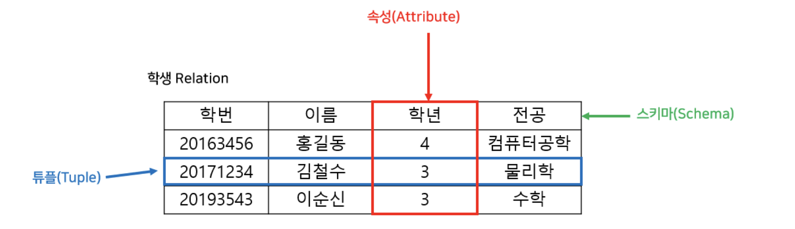

# Relational Model



### Relational Model
- RM은 데이터를 테이블(관계)로 구성 (테이블은 특정 엔터티와 속성을 나타냄)
- 구성 : 관계(테이블), 기본 키, 외래 키, 관계형 작업(조인 등)

   
### Attribute (속성)
- 엔터티에 대한 특정 특성 혹은 정보를 나타낸다.
    - 이름과 타입, 이름은 집합 안에서 유일해야함 (유니크)
- 테이블의 열에 저장할 수 있는 데이터를 정의한다.
- 유저를 나타내는 데이터베이스 테이블에서 특성은 유저 ID, 이름, 나이 등이 포함될 수 있다.
- 각 속성은 정수, 문자열, 등등과 같은 데이터 타입 유형이 있다.
- 자료를 속성과 타입으로 짓는다 
    - name : string
   
`모델링되는 엔터티의 특성을 설명하는 방법을 제공하여 데이터베이스가 엔터티에 대한 관련 정보를 저장하고 검색할 수 있도록 한다.`
   
#### 특징
- key - value 와 비슷
    - 이름/문자열
    - 나이/정수 (최대 n자리)
    - 성별/문자
- 이런것이 속성이며, 대개 컬럼으로 구현된다.


### Tuple (튜플)
- 테이블의 단일 행 또는 레코드를 나타낸다.
- 엔터티의 특정 인스턴스를 나타냄
- 테이블에 정의된 속성에 해당하는 값이 포함된다. 
- 유저 이름의 속성안에 '홍길동'이라는 특정 유저를 나타낸다.
    - 속성의 값을 포함

`일반적으로 튜플은 순서가 없다. DB가 튜플에 순서를 부여하지 않는다. 
하지만 튜플 내의 속성에는 테이블의 스미카 또는 정의에 따라 특정 순서가 있다.`

#### 특징
- (속성, 값) 쌍의 집합
- 하나의 집합에서 속성 이름은 유일하기 떄문에 속성 이름은 겹치지 않는다.

- 예시: {(이름/문자열, 견우), (나이/정수, 13), (성별/문자, 남)}
- 대개는 Row, Record로 구현된다.

> 튜플은 집합이기때문에 중복을 허용하지 않지만 대부분의 RDBMS는 중복을 허용한다. 그리고 NULL도 허용함


### Relationship (관계)
- 서로 다른 테이블의 엔터티 간의 연결을 정의한다.
- 관련되는 방식을 나타냄
- 관계는 기본키와 외래키를 사용하여 설정된다.
- 기본 키는 테이블의 각 튜플을 고유하게 식별하고 왜래키는 다른 테이블의 기본키에 대한 참조이다.
- 기본키와 외래키를 연결하면 테이블 간에 관계가 생성된다.
   
게시글과 유저 테이블 간에 관계가 있을 수 있다.
유저는 게시글을 작성한다.
user 테이블의 기본 키인 id는 관계 설정을 위해 board(post) 테이블에서 외래 키 역할을 하게 되는 것이다.
   
`관계 설정은 데이터 무결성을 유지하고 참조 무결성 제약 조건을 적용하며 관련 데이터의 효율적인 쿼리 및 검색을 하는데 도움이 된다.`

#### 특징
- (속성의집합, 튜플의 집합) 쌍
- 속성의 집합을 heading, 튜플의 집합을 body라고 구분함
- 그냥 관계는 튜플의 집합이라고 할 수도 있다.

- 예
```
{
	// heading
	{ 이름/문자열, 나이/정수, 성별/문자 },
	// body
	{ (이름/문자열, 견우), (나이/정수, 13), (성별/문자, 남) },
	{ (이름/문자열, 직녀), (나이/정수, 12), (성별/문자, 여) }
	}
}
```
   
- people -> 관계 변수 (테이블)


- 관계는 시간에 따라 변하기 때문에 관계 변수란 개념을 구분해서 사용 가능

- 대개 테이블로 구현
- 속성 집합을 스키마로 표현


## 학습 키워드
- 관계 데이터 모델 용어 정리
    - 속성
    - 튜플
    - 관계


[](https://hits.sh/p-ej.gitbook.io/devroad-backend/megatera-backend/introduction/)