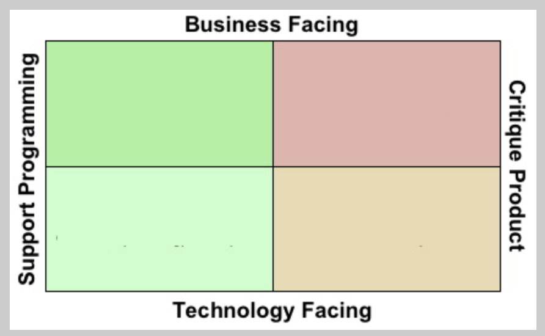

# Unit Test


### Unit Test(단위 테스트)란
- **프로그램의 가장 작은 테스트 가능한 구성 요소인 개별 단위를 개별적으로 테스트하여 정확성과 기능을 확인하는 소프트웨어 테스트 접근 방식이다.**
- 특정 작업을 수행하는 단일 함수, 메서드 혹은 클래스
- 개발자가 직접 작성, JUnit 등과 같은 테스트 프레임워크가 있다.

#### 목적
- 각 코드 단위가 예상대로 작동하고 주어진 입력 상황에 대해 원하는 출력을 하는지 확인하는 것이다.
- 특정 동작 혹은 시나리오를 대상으로 하는 테스트 사례를 작성한 다음(테스트 시나리오) 해당 테스트를 실행하여 기능을 검증한다.

#### 특징
1. 격리 
- 각 단위 테스트는 시스템의 다른 부분과 독립적으로 격리된 단일 단위 테스트에 중점을 둔다.
2. 결정론
- 실행될 때마다 동일한 결과를 생성해야 한다. 
- 테스트가 신뢰할 수 있고 반복이 가능하다는 것을 보장한다.
3. 빠른 실행
- 빠르게 실행되어 개발자가 개발 중이나 지속적인 통합 프로세스의 일부로 자주 실행할 수 있다.
- 빠른 실행이 되면 코드 변경의 신속한 피드백이 가능하다.
4. 어설션
- 어셜선을 사용하여 테스트 중인 유닛의 실제 출력과 예상 출력을 비교한다.

#### 장점
1. 초기 버그 감지
- 개발 프로세스 초기에 버그와 결함을 찾아 수정하는데 쉽고 비용이 적게 든다.
2. 코드 신뢰
- 개발자에게 코드의 정확성과 기능에 대한 확신을 제공하여 코드베이스를 쉽게 변경하거나 리팩토링 할 수 있도록 한다.
3. 문서화
- 어떻게 작동할 것으로 예상되는지 설명하는 문서 역할을 한다.
- 테스트 단위의 목적과 사용에 대한 정확히 알 수 있다.
4. 향상된 유지 관리
- 코드 수정 중에 회귀를 도입할 위험을 줄여 코드 베이스를 더 잘 유지 관리할 수 있게 만든다.
5. 공동 작업 
- 코드 동작에 대한 내용을 공유 함으로써 서로간의 이해를 제공하고 다양한 구성 요소를 보다 쉽게 통합할 수 있도록 하여 팀간의 공동 작업에 도움이 된다.

### V-Model
- **소프트웨어 개발 단계와 해당 테스트 활동간의 관계를 강조하는 소프트웨어 개발 및 테스트 프로세스 모델을 나타낸다.**
- 테스트쪽에서 자주 언급되는 모델이다.
- 각 개발 단계에 대해 테스트 설계가 있다.
    - 요구사항 단계 다음에는 요구 사항을 기반으로 한 테스트 단계가 이어진다.
- 설계 기반 테스트, 단위 테스트에 의한 코딩 단계 등이 있다.
- 뒤로 돌아갈 수 없는 폭포수 모델은 현실에 부합하지 않지만, 폭포수 모델이 다루는 단계들은 매우 유용, 이 단계들을 이용하여 테스트를 설계한다.

#### 장점
1. 초기 결함 감지
    - 개발 프로세스 초기에 테스트 활동을 통합하면 초기 단계에서 결함을 식별하고 해결할 수 있으므로 이후 수정에 필요한 비용과 노력을 줄일 수 있다.
2. 추적성
    - 요구사항, 설계 및 테스트 단계 간의 추적성을 강조한다.
    - 모든 요구 사항이 해당 테스트에서 적절하게 해결되고 진행 상황과 적용 범위를 알아내는데 도움이 된다.
3. 재작업 감소
    - 개발 생명주기(라이프 사이클) 초기에 문제를 식별하고 해결함으로써 이후 단계에서 주요 재작업 또는 재설계 가능성을 줄이는데 도움이 된다.
4. 향상된 협업
    - 각 활동 간의 명확한 관계를 설정하여 개발 팀과 테스트 팀 간의 협업과 커뮤니케이션을 장려한다.

#### 특징
- 개발 및 테스트에 대한 순차적이고 구조화된 접근 방식이라는 점에 유의해야한다. (다시 돌아갈 수 없다는 뜻?)
    - 요구사항이 불분명하면 돌아갈 수 있긴 해야함. (모델상 그렇다)
- 하지만 최신 소프트웨어 개발 관행에서는 유연한 테스트 사분면 또는 테스트 피라미드와 같은 다른 모델을 따를 수 있는 반복적이고 유연한 방법론이 선호되는 경우가 많다고 한다.
- V 모델은 각 단계에 대한 테스트를 나누고, 처음부터 어떻게 테스트해야 하는지 결정하려고 노력한다.
- 최종적으로 인수테스트 통과 시 요구사항을 만족했다 라고 봄
    - 시스템을 다 만들어서 써봐야 안다.

#### V-Model 테스트 종류
1. 요구사항 분석 -> 사용자 중심 => 인수 테스트
2. 시스템 설계 -> 시스템 사양 결정 => 시스템 테스트
3. 아키텍처 설계 -> 고수준 설계 => 통합 테스트
4. 모듈 설계 -> 저수준 설계 => 단위 테스트
5. 구현 -> 코딩 


### Test Matrix 
- **소프트웨어 애플리케이션에 대한 포괄적인 테스트 커버리지를 달성하기 위해 실행해야 하는 다양한 테스트 사례 조합의 문서 또는 표현**

#### 특징

- 일반적으로 두 개 이상의 차원으로 구성되며 각 차원은 테스트 중인 시스템의 특정 측면 또는 매개변수를 나타낸다.

1. 테스트 시나리오: 다양한 사용자 상호 작용, 입력 조합 또는 시스템 상태를 포함하여 테스트해야 하는 다양한 기능적 또는 비기능적 시나리오.

2. 운영 체제: 호환성 및 플랫폼별 기능을 보장하기 위해 소프트웨어를 테스트해야 하는 다양한 운영 체제(예: Windows, macOS, Linux).

3. 브라우저 및 장치: 브라우저 간 호환성 및 반응형 디자인을 보장하기 위해 소프트웨어를 테스트해야 하는 다양한 웹 브라우저(예: Chrome, Firefox, Safari) 및 장치(데스크탑, 모바일, 태블릿).

4. 구성: 다양한 데이터베이스 유형, 서버 설정 또는 네트워크 조건과 같은 소프트웨어의 다양한 구성 또는 설정.

5. 통합 지점: 상호 운용성 및 데이터 일관성을 테스트해야 하는 외부 시스템, API 또는 데이터베이스와의 다양한 통합 지점.

6. 사용자 역할: 다양한 사용자 역할(예: 관리자, 일반 사용자, 게스트) 및 테스트해야 하는 관련 권한 및 액세스 수준.

> 테스트 영역이 굉장히 넓지만 우리가 해야하는건 절반
   
- 우리의 한계를 알자. 가 관건 
- 내적 품질이 우수하면 외적 품질을 끌어올리거나 대응하기 좋음 
- 코드가 깔끔하면 문제가 생겻을때 쉽게 원인 파악하고 고칠 수 있음 
- 사용자에게 도움이 되진않음
- 유지보수, 대응하기좋음, 제품 개선에 좋음

#### 장점 
1. 포괄적 범위
    - 소프트웨어의 중요한 측면이 철저히 테스트되도록 보장해야 하는 다양한 조합과 시나리오를 식별하는 데 도움된다.
2. 효율적인 테스트 계획
    - 테스트 매트릭스는 테스트가 필요한 특정 조합 및 구성을 식별하여 프로세스를 보다 효율적으로 만들어 테스트 노력을 계획하는 데 도움된다.
3. 우선 순위 지정
    - 매트릭스를 통해 테스터는 중요한 조합 또는 시나리오를 기반으로 테스트 노력의 우선 순위를 지정하여 소프트웨어의 가장 중요한 측면을 먼저 테스트할 수 있다.
4. 문서화
    - 테스트의 진행 상황과 적용 범위를 추적하는 문서 역할을 하여 테스트 노력에 대한 검토, 전달 및 보고를 더 쉽게 만든다.

#### 내부 품질과 외부 품질
- 보통 품질에 대해 2가지를 많이 얘기함
1. 내부 품질
    - 게임을 실행했을때 잘 돌아가지만 내부를(클라이언트나 엔진 같은?) 깠는데 구조가 조금하다. 얼마 있으면 버그와 오류가 날것 같음.
    - 전자제품 안에 뜯어볼떄 좀 이상한데 ? 이런것들 
    - 내부 품질을 고려해도 당장의 성과가 보이진않는다.
    - 내부 품질은 당장 큰 성과를 내지 않음 (그래서 놓칠때가 많음)
2. 외부 품질
    - 인수 테스트 관점에서 봤을때 결과가 틀리게 나오면 잘못된 것이다..

#### 추가 이야기
지속가능한 상태만들기 
- 책상정리안해도 공부는 할 수 있음 
- 하지만 앞으로가 문제임 

테스트는 하나의 관점으로 접근하지 않음 
테스트 목적 : 프로그래밍을 돕는건지, 제품품질, 비즈니스 차원, 기술적인 차원 등 여러가지를 본다. 

내가 문제를 바라볼때 어디에서 생기는가를 볼 수 있음

**개발자 테스트**
- QA, 사용자 테스트 등을 통해 발견
- 개발자가 커버해야하는 테스트 

**우리가 다루는건 개발자 테스트**
- 미리 계획할 수 있는것

#### 내부 품질을 높이면 좋은 이유
1. 초기 버그 감지
2. 개선된 코드의 안정성 확보
3. 리팩토링
4. 문서화 및 이해
5. 지속적인 통합 및 전달
6. 팀 협업
7. 코드 유지 관리 가능성
8. 코드 품질 및 규율

### JUnit 5 (Unit Test)
- Java용 오픈 소스 테스트 프레임워크이다.
- 메서드, 클래스 또는 구성 요소와 같은 개별 코드 단위를 독립적으로 테스트하는 단위 테스트를 지원하도록 설계되었다.

#### 특징
- 테스트 작성 및 실행 프로세스를 단순화하는 일련의 주석, 어설션 및 API를 제공
- TDD(테스트 주도 개발) 원칙을 따르고 개발자가 해당 코드를 구현하기 전에 테스트를 작성할 수 있도록 하여 코드 품질 및 유지 관리성을 향상시킴
- 자동화된 테스트 지원
- 단위 테스트만 지원하진 않고 통합, E2E 테스트를 작성하는데도 사용 
SUnit -> XUnit
#### 구성
1. Annotations
    - 어노테이션을 사용하여 테스트 메서드를 표시하고 테스트 실행 방법에 대한 추가 정보를 제공한다.
```java
@Test
@Before
@After
@RunWith
```

2. Assertions
- 개발자가 테스트 중인 코드의 예상 결과 및 동작에 대한 어셜션을 만들 수 있는 내장된 어설션 세트를 제공한다.
- 어설션은 조건을 확인하고 조건이 충족되지 않으면 실패를 반환한다.
```java
assertEquals() 
assertTrue()
assertFalse()
assertNull()
```

3. Test Fixtures
- 사용하면 테스트 환경을 설정하거나 정리 작업을 수행하는 메서드인 테스트 픽스처를 만들 수 있다.
> 테스트 전에 실행해야하는 작업
```java
@Before
```

> 테스트 후에 실행해야하는 작업
```java
@After
```


### E2E 테스트
- 종단간 테스트는 처음부터 끝까지 애플리케이션의 전체 흐름을 검증하는 것을 목표로 하는 소프트웨어 테스트 방법론이다.
- 실제 시나리오에서 전체 시스템 또는 애플리케이션을 테스트하고, 사용자 상호 작용을 시뮬레이션하고, 모든 구성 요소가 예상대로 함께 작동하는지 확인하는 작업이 포함된다.
- 개별 단위나 구성 요소를 개별적으로 테스트하지 않고 애플리케이션을 전체적으로 테스트한다.

#### 특징
1. 현실적인 시나리오 
    - 실제 시나리오와 사용자 상호 작용을 시뮬레이션하도록 설계되었다.
    - 일반적으로 데이터 입력, 버튼 클릭, 다른 페이지 또는 화면 탐색, 예상 결과 확인과 같은 일련의 작업 실행이 포함된다.
2. 전체 시스템 통합
    - 애플리케이션의 모든 구성 요소와 계층이 올바르게 통합되고 서로 효과적으로 통신하는지 확인한다.
    - 프론트 엔드 사용자 인터페이스, 백 엔드 서비스, 데이터베이스, 외부 API 및 기타 관련 구성 요소 간의 테스트 상호 작용이 포함된다.
3. 사용자 경험 검증 
    - 애플리케이션의 사용자 경험 검증에 중점을 둔다.
    - 응용 프로그램이 올바르게 작동하는지, 사용자 입력에 적절하게 응답하고 예상 출력과 결과를 제공하는지 확인한다. 
4. 종단 간 흐름
    - 다양한 사용 사례 및 사용자 여정을 포함하여 애플리케이션의 전체 흐름을 다룬다.
    - 초기 사용자 상호 작용 또는 입력에서 최종 결과 또는 결과에 이르기까지 전체 프로세스를 테스트한다.
5. 크로스 플랫폼 및 크로스 브라우저 
    - 종종 다양한 환경에서 호환성과 일관성을 보장하기 위해 다양한 플랫폼(ex: 데스크톱, 모바일 또는 웹) 및 여러 브라우저에서 수행된다.
6. 블랙박스 테스트
    - 일반적으로 내부 구현 세부 정보에 대한 직접적인 지식 없이 사용자 관점에서 수행된다.
    - 테스터는 특정 코드 수준 테스트보다는 애플리케이션의 동작 및 예상 출력에 중점을 둔다.
7. 자동 테스트 
    - 테스트 프레임워크와 도구를 사용하여 자동화된다.
    - 이를 통해 테스트 시나리오의 반복, 더 빠른 실행 및 테스트 스위트의 더 쉬운 유지 관리가 가능하다.

> - E2E 테스트는 다양한 구성 요소의 상호 작용 또는 외부 시스템과의 통합으로 인해 발생할 수 있는 문제 및 결함을 식별하는 데 도움이 된다. 
> - 애플리케이션의 기능, 성능, 안정성 및 전반적인 사용자 경험을 검증한다. 
> - 전체 흐름을 테스트함으로써 E2E 테스트는 애플리케이션이 의도한 대로 작동하고 최종 사용자의 요구 사항을 충족한다는 확신을 제공한다.

## 학습 키워드
- V 모델
- Test Matrix
- 내적 품질(테스트 코드 작성등)을 높이면 좋은 이유
- JUnit
- 단위 테스트
- E2E 테스트